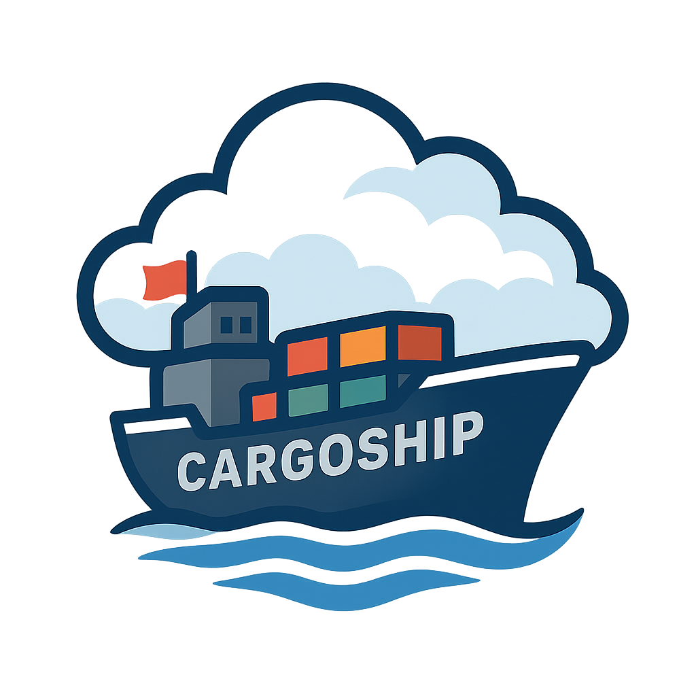

<div align="center">
  
  <h1>CargoShip</h1>
  <p><strong>High-performance S3 data archiving</strong></p>
</div>

[](https://github.com/scttfrdmn/cargoship/blob/main/go.mod)
[](https://pkg.go.dev/github.com/scttfrdmn/cargoship)
[](LICENSE)
[](https://github.com/scttfrdmn/cargoship/releases)
[](https://goreportcard.com/report/github.com/scttfrdmn/cargoship)
[](https://codecov.io/gh/scttfrdmn/cargoship)
[](https://github.com/securecodewarrior/gosec)
[](https://github.com/scttfrdmn/cargoship/actions)
[](https://github.com/scttfrdmn/cargoship/issues)
[](https://github.com/scttfrdmn/cargoship/pulls)

CargoShip turns large directory trees into compressed, verifiable, portable
archives streamed directly to Amazon S3. It is for research and technical
datasets with many files, where ordinary copy tools create excessive S3
requests, give weak recovery guarantees, or make storage costs hard to predict.

## Why not plain `aws s3 cp` or `rclone`?

Those tools copy files one-to-one, which turns a million-file dataset into a
million S3 requests with no packaging, manifest, or cost model. CargoShip packs
files into compressed archives, shards uploads across S3 prefixes for
throughput, records a verifiable manifest, and can estimate cost before you
commit. See the [feature comparison](https://cargoship.app/reference/comparison)
for a side-by-side breakdown.

## Installation

```bash
# Homebrew (macOS/Linux)
brew install scttfrdmn/tap/cargoship

# Scoop (Windows)
scoop bucket add scttfrdmn https://github.com/scttfrdmn/scoop-bucket
scoop install cargoship

# Go install
go install github.com/scttfrdmn/cargoship/cmd/cargoship@latest
```

Pre-built binaries for macOS, Linux, and Windows are on the
[releases page](https://github.com/scttfrdmn/cargoship/releases). CargoShip
reads AWS credentials from the standard SDK chain (environment, shared config,
or IAM role); see [AWS setup](https://cargoship.app/start/aws-setup) for the
minimal IAM policy and the [installation guide](https://cargoship.app/start/install)
for more options.

## Example

A complete round trip: estimate, upload, inspect, verify, and restore a single file.

```bash
# 1. Estimate cost before uploading
cargoship estimate /data/project-2024 --storage-class deep-archive

# 2. Upload a directory to S3 (canonical command)
cargoship upload /data/project-2024 s3://my-bucket/project-2024 \
  --storage-class INTELLIGENT_TIERING

# 🚢 Uploading: 1234 files | 5.67 GB | 89 chunks | 123.4 MB/s | 1m30s elapsed
# ✅ Upload Complete!  Upload ID: 20260721-123456-abcd1234

# 3. Inspect what was uploaded, straight from the manifest (no download)
cargoship info s3://my-bucket/project-2024

# 4. Verify the archive against its manifest checksums
cargoship verify s3://my-bucket/project-2024

# 5. Restore a single file without pulling the whole archive
cargoship restore s3://my-bucket/project-2024 \
  --file results/summary.csv --output ./restored/
```

See the [quick start](https://cargoship.app/start/quickstart) for a guided
walkthrough and the [command reference](https://cargoship.app/reference/) for
every command and flag.

Sharding is chosen automatically from the workload, but you can override it:

```bash
cargoship upload /data/project-2024 s3://my-bucket/project-2024 --shard-count 16
```

## Common commands

| Command | Purpose |
|---------|---------|
| `cargoship estimate` | Model storage cost before uploading |
| `cargoship upload` | Pack, compress, and stream a directory to S3 |
| `cargoship info` | Inspect an archive from its manifest, no download |
| `cargoship verify` | Check archive contents against manifest checksums |
| `cargoship restore` | Restore all or selected files from an archive |
| `cargoship budget` | Set and monitor per-project cost and volume budgets |
| `cargoship lifecycle` | Manage S3 lifecycle policies for stored archives |

## Key differentiators

- **Zero-disk streaming pipeline** — files stream from disk through compression
  to S3 with no local staging; memory stays bounded to `chunk_size × workers`.
- **Multi-prefix sharding** — chunks are distributed across S3 prefixes, so
  request-rate capacity scales with the shard count. CargoShip automatically
  selects between 4 and 32 shards when `--shard-count` is 0 (the default); if
  automatic selection fails, it falls back to 8. See
  [sharding](https://cargoship.app/guides/features/sharding).
- **Content-aware compression** — zstd compresses text and code well and skips
  already-compressed data. See [compression](https://cargoship.app/guides/features/compression).
- **Cost and budget controls** — estimate spend before uploading and enforce
  per-project cost and volume budgets. See [budgets](https://cargoship.app/guides/cost/budgets).
- **Open, portable format** — archives are `tar.zst` with a JSON manifest, both
  readable with standard tools. See the [format spec](https://cargoship.app/reference/format/).

CargoShip suits research data, analytics output, long-term backup and
compliance retention, and cold-tier data-lake migration — anywhere a large file
count and predictable cost matter more than one-to-one file copies.

## Safety and portability

CargoShip never modifies source files; it only reads them. Archives use the
open `tar.zst` format alongside a plain JSON manifest, so your data stays
recoverable with standard tools (`tar`, `zstd`, `jq`) even without CargoShip
installed. The manifest records per-file checksums, letting `cargoship verify`
confirm integrity after upload and letting `cargoship restore` pull a single
file without downloading the whole archive. The
[format spec](https://cargoship.app/reference/format/) documents the layout in
full.

## Documentation

Full documentation lives at **[cargoship.app](https://cargoship.app)**.

### Getting started
- [Quick Start](https://cargoship.app/start/quickstart) — zero to a verified upload in minutes
- [Installation](https://cargoship.app/start/install) — get CargoShip running in your environment
- [AWS Setup & Credentials](https://cargoship.app/start/aws-setup) — credentials and minimal IAM policy
- [How It Works](https://cargoship.app/intro/how-it-works) — the streaming pipeline, explained
- [Command Reference](https://cargoship.app/reference/) — every command and flag

### Guides & tutorials
- [Use-case Tutorials](https://cargoship.app/tutorials/) — genomics, imaging, ML/DVC, lab data
- [Performance Tuning](https://cargoship.app/guides/features/optimization) — throughput knobs and benchmarks
- [Benchmarks & Methodology](https://cargoship.app/reference/benchmarks) — reproduce the numbers on your own hardware
- [Migration from rclone / aws cli](https://cargoship.app/tutorials/migrating) — switching to CargoShip
- [upload vs. create upload](https://cargoship.app/guides/upload-vs-create-upload) — the advanced tuning variant

### Cost & format
- [Estimating Costs](https://cargoship.app/guides/cost/estimate) — model spend before uploading
- [Budgets & Quotas](https://cargoship.app/guides/cost/budgets) — project-based cost and volume tracking
- [Lifecycle & Storage Tiers](https://cargoship.app/guides/cost/lifecycle) — tier selection and retrieval costs
- [Archive & Manifest Format Spec](https://cargoship.app/reference/format/) — the open, portable format

### Project
- [Architecture](https://cargoship.app/project/architecture) — system design
- [Project Maturity & Compatibility](https://cargoship.app/project/maturity) — what's stable vs. beta
- [Comparison](https://cargoship.app/reference/comparison) — CargoShip vs. other tools
- [Contributing](CONTRIBUTING.md) — how to get involved
- [Security Policy](SECURITY.md) — reporting vulnerabilities

## Project status and license

CargoShip is at **v0.21.0** and is a community-maintained v0.x project — the CLI
and archive format are usable in production, with compatibility caveats tracked
on the [maturity page](https://cargoship.app/project/maturity). To report a
security issue, see [SECURITY.md](SECURITY.md).

Licensed under the Apache License 2.0; see [LICENSE](LICENSE). Originally
inspired by Duke University's [SuitcaseCTL](https://gitlab.oit.duke.edu/devil-ops/suitcasectl)
research project, now an independent project.

## Support

- Documentation: [cargoship.app](https://cargoship.app)
- Issues: [GitHub Issues](https://github.com/scttfrdmn/cargoship/issues)
- Community: [GitHub Discussions](https://github.com/scttfrdmn/cargoship/discussions)
