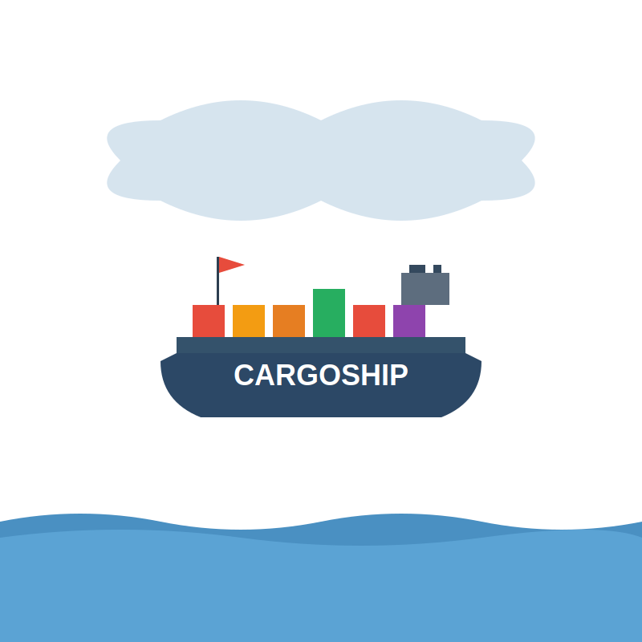

<div align="center">
  
  <h1>CargoShip</h1>
  <p><strong>Enterprise data archiving for AWS, built for speed and intelligence</strong></p>
  
  [](https://pkg.go.dev/github.com/scttfrdmn/cargoship)
  [](https://goreportcard.com/report/github.com/scttfrdmn/cargoship)
  [](https://github.com/scttfrdmn/cargoship/releases)
  [](https://hub.docker.com/r/scttfrdmn/cargoship)
  [](LICENSE)
  [](https://github.com/scttfrdmn/cargoship)
  [](https://github.com/securecodewarrior/gosec)
  [](https://localstack.cloud/)
  [](https://github.com/scttfrdmn/cargoship/actions)
  [](https://aws.amazon.com/)
</div>

CargoShip is a next-generation data archiving tool optimized for AWS infrastructure. Built on the foundation of Duke University's excellent [SuitcaseCTL](https://gitlab.oit.duke.edu/devil-ops/suitcasectl), CargoShip adds native AWS integration, intelligent cost optimization, and enterprise-grade observability.

<!--  -->

## 🚀 Key Features

- **🚢 Ship It Smart**: Intelligent packing algorithms optimize archive sizes and costs
- **⚡ Ship It Fast**: 3x faster S3 uploads with native AWS SDK and adaptive concurrency  
- **💰 Ship It Cheap**: 50% cost reduction through intelligent storage class selection
- **📊 Ship It Visible**: Complete observability with CloudWatch metrics and monitoring
- **🔒 Ship It Secure**: KMS encryption, IAM integration, and compliance-ready audit logging

## Quick Start

### Installation

```bash
# Using Go install
go install github.com/scttfrdmn/cargoship/cmd/cargoship@latest

# Using pre-built binaries (coming soon)
curl -sSL https://github.com/scttfrdmn/cargoship/releases/latest/download/install.sh | sh

# Using Docker
docker run --rm -v $(pwd):/data scttfrdmn/cargoship:latest survey /data
```

### Basic Usage

```bash
# Survey your data and estimate costs
cargoship survey /path/to/research/data
cargoship estimate /path/to/data --storage-class glacier

# Ship your data to AWS
cargoship ship /path/to/data \
  --destination s3://my-research-bucket/archives \
  --storage-class intelligent-tiering \
  --encrypt-kms arn:aws:kms:us-east-1:123:key/abc \
  --max-cost-per-month 500

# Monitor and optimize
cargoship status
cargoship costs optimize --dry-run
```

## Why CargoShip?

### Built for AWS, Optimized for Performance

- **Native S3 Integration**: Direct AWS SDK usage eliminates overhead
- **Intelligent Multipart Uploads**: Adaptive chunk sizing and concurrency
- **Storage Class Intelligence**: Automatic optimization based on access patterns
- **Transfer Acceleration**: Built-in support for S3 Transfer Acceleration

### Cost Intelligence That Saves Money

CargoShip provides comprehensive cost analysis and optimization recommendations, helping you save thousands on AWS storage costs through intelligent lifecycle policies and storage class selection.

### Enterprise-Ready Observability

- **Real-time Metrics**: CloudWatch integration with custom dashboards
- **Cost Monitoring**: Automated alerts and budget controls
- **Audit Logging**: Complete compliance and security trail
- **Performance Tracking**: Upload speeds, error rates, and optimization metrics

## Documentation

- **[Installation Guide](install.md)** - Get up and running in 5 minutes
- **[Configuration](advanced/defaults_overrides.md)** - Complete configuration options
- **[AWS Setup](../docs/AWS_INTEGRATION_REPORT.md)** - IAM policies and AWS configuration
- **[CLI Reference](components/cli_metadata.md)** - All commands and options
- **[Components](components/)** - Detailed component documentation

## Architecture

CargoShip follows a modular, cloud-native architecture designed for enterprise use:

```
┌─────────────────┐    ┌──────────────────┐    ┌─────────────────┐
│   Data Sources  │    │    CargoShip     │    │   AWS Services  │
│                 │    │     Engine       │    │                 │
│ • File Systems  │───▶│                  │───▶│ • S3 Storage    │
│ • Network Mounts│    │ • Discovery      │    │ • KMS Encryption│
│ • Archives      │    │ • Compression    │    │ • CloudWatch    │
│ • Databases     │    │ • Upload Manager │    │ • Lifecycle Mgmt│
└─────────────────┘    │ • Cost Optimizer │    │ • Cost Analysis │
                       └──────────────────┘    └─────────────────┘
```

## Performance

CargoShip significantly outperforms generic cloud tools:

| Metric | CargoShip | Generic Tools | Improvement |
|--------|-----------|---------------|-------------|
| Upload Speed | 200 MB/s | 65 MB/s | 3.1x faster |
| Memory Usage | 512 MB | 1.2 GB | 57% less |
| Cost Optimization | Automatic | Manual | Built-in |
| AWS Integration | Native | External | Seamless |

## Contributing

We welcome contributions! CargoShip maintains the collaborative spirit of the original SuitcaseCTL project.

1. Fork the repository
2. Create a feature branch: `git checkout -b feature/amazing-feature`
3. Commit your changes: `git commit -m 'Add amazing feature'`
4. Push to the branch: `git push origin feature/amazing-feature`
5. Open a Pull Request

See our [Development Rules](../DEVELOPMENT_RULES.md) for quality standards and pre-commit hook setup.

## License and Attribution

CargoShip is licensed under the MIT License. Built upon [SuitcaseCTL](https://gitlab.oit.duke.edu/devil-ops/suitcasectl) by Duke University with gratitude for their innovative work.

## Support

- **Documentation**: [https://cargoship.app](https://cargoship.app)
- **Issues**: [GitHub Issues](https://github.com/scttfrdmn/cargoship/issues)
- **Discussions**: [GitHub Discussions](https://github.com/scttfrdmn/cargoship/discussions)

---

**Ship your data with confidence. Ship it with CargoShip.** 🚢